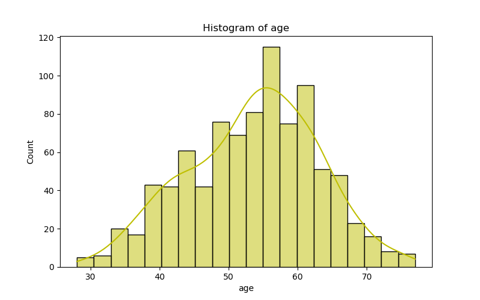
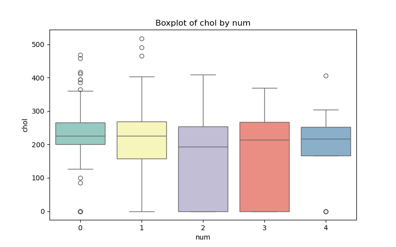
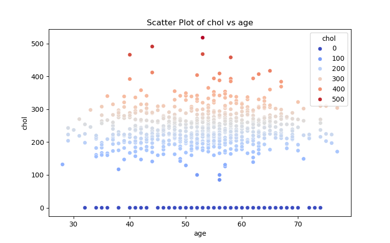

# Heart Disease Data Analysis & Machine Learning Exploration

**Author:** Ogechukwu Ezenwa  
**Date:** September 9, 2025  
**Course:** IDS 706 – Data Engineering Systems  
**Assignment:** Week 2 Mini-Assignment

---

## Overview

This project analyzes the Heart Disease dataset to identify patterns in diagnostic measurements and explores a simple machine learning model to predict the presence of heart disease.

---


## Installation & Setup


1. Clone the repository:

```bash
git clone https://github.com/Gechyb/IDS706_DE_Wk1.git
```
 

2. Using `requirements.txt` - Install the required Python packages:

```bash
make install
```

2. Fun the analysis
```bash
make all
```

## Project Structure

- **data_analysis.ipynb**  
  Jupyter Notebook used for **initial data exploration and visualization**.  
  This includes checking for missing values, duplicates, summary statistics, and plotting feature distributions.  
  The purpose of this notebook was to explore the dataset interactively before refactoring the steps into reusable functions in `data_analysis.py`.

- **data_analysis.py**  
  Python script containing modular functions for loading, cleaning, analyzing, and modeling the dataset.  
  This script represents the finalized workflow after insights from the notebook exploration.

---

## Steps Performed

### 1. Import & Inspect Data
- Loaded the dataset from CSV.
- Displayed the first 5 rows and dataset shape.
- Checked column data types.

**Observations:**  
All columns loaded correctly; no missing values in this dataset.

### 2. Clean & Preprocess Data
- Checked for missing values and duplicates.
- Dropped duplicate rows.
- Checked summary statistics and data types for each column.

**Observations:**  
Dataset is clean with no missing values and few/no duplicates.

### 3. Outlier Detection & Removal
- Applied z-score method on numeric columns.
- Removed rows with z-score > 3 as outliers.

**Observations:**  
Outlier removal helped reduce extreme values in age, chol, trestbps, etc.

### 4. Filtering & Grouping
- Filtered patients with age > 50 and chol ≥ 240.
- Grouped data to calculate:
    - Average cholesterol by sex.
    - Count of patients by chest pain type.
    - Summary statistics (mean and max) by sex and chest pain type.

**Observations:**  
Older patients and those with high cholesterol are more likely to have heart disease indicators.

### 5. Categorical Variable Encoding
- **Label Encoding:** Converts categorical variables to numeric labels (e.g., sex → 0/1).
- **One-Hot Encoding:** Creates binary columns for each category (e.g., cp_1, cp_2…).
- Applied to: sex, cp, fbs, restecg, exang.

**Observations:**  
Encoding allowed categorical data to be used in machine learning models.

### 6. Machine Learning Exploration
- Chose Linear Regression to predict the target variable `num` (heart disease presence).
- Two approaches tested:
    - Label Encoding for categorical variables.
    - One-Hot Encoding for categorical variables.
- Evaluated using Mean Squared Error (MSE) and R² Score.

**Observations:**  
Linear Regression is not ideal for binary classification, but it illustrates model training, feature selection, and evaluation.

### 7. Data Visualization
- **Histogram:** Distribution of age.


- **Boxplot:** Cholesterol levels grouped by heart disease presence (`num`).


- **Scatter Plot:** Age vs cholesterol.


**Observations:**
- Most patients are between 50–65 years old.
- Higher cholesterol is generally associated with patients diagnosed with heart disease.
- Scatter plot shows some correlation between age and cholesterol but with variance.

---

## How to run data_analysis.py

```bash
make run
```

The script will:
- Load the dataset.
- Clean and preprocess data.
- Remove outliers.
- Filter and group data.
- Encode categorical variables.
- Run linear regression models.
- Display visualizations.

---

## Findings & Insights

- Older patients with higher cholesterol may have a higher likelihood of heart disease.
- Categorical features like sex and chest pain type show differences in heart disease prevalence.
- Linear Regression can predict numeric outcomes, but classification models would be more suitable for predicting heart disease (0/1).

---

## Notes

- **Dataset source:** [Kaggle – Heart Disease UCI](https://www.kaggle.com/datasets/navjotkaushal/heart-disease-uci-dataset)
- **Packages required:** `pandas`, `numpy`, `scipy`, `matplotlib`, `seaborn`, `scikit-learn`
